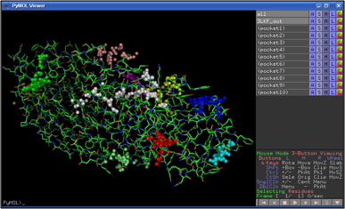

# Getting started

#### Quicklinks:

* [fpocket basics](#fpocket-simple-pocket-detection)
* [dpocket basics](#dpocket-descriptor-extraction)

## fpocket - simple pocket detection

To run the following examples, we use several sample input file `data/sample/` directory). 

### Example

Here you have a very simple and straightforward example of how to run fpocket on a single PDB file downloaded from the RCSB PDB. The following command line will execute fpocket on the 1UYD.pdb file situated in the sample directory.

`fpocket -f sample/1UYD.pdb`

It is mandatory to give a PDB input file using the -f flag in command line. If nothing is given, fpocket prints the fpocket usage/help to the screen. fpocket will use standard parameters for the detection of pockets. Fore more information about these parameters see the [advanced fpocket features](#fpocket-advanced).

If fpocket works properly the output on the screen should look like this :
```bash
=========== Pocket hunting begins ==========
=========== Pocket hunting ends ============
```

If you have a look now in the sample directory, you will notice that fpocket created a folder named 1UYD_out/. This folder contains all the output from fpocket, so what you are actually interested in. If you just want to see rapidly the results, go to the 1UYD_out directory and launch the 1UYD_VMD.sh script. This script will launch the VMD molecular visualizer and load the protein with binding site information coming from fpocket.


The illustration above is somehow what you will see if you launch the VMD script. VMD is well suited for representing the volume of alpha spheres and their respective centers. Usually the visual volume information is not of primordial importance, as the larger alpha spheres tend to reach far out of the protein and smaller alpha spheres are not visible because they are recovered by larger ones. As it can be seen within the Main VMD window, the visualization script loads 3 structures, all of them are explained in more detail in the output section of this chapter.

If you had a closer look before on the methodological aspects of this algorithm (we invite you to read the paper) a natural question would be how to represent apolar and polar alpha spheres. Currently the color code represents only the residue ID (rank of the cavity). If you want to see characteristics of alpha spheres we invite you to change the representation of alpha spheres. This can be found by clicking Graphics -> Representations. Another window will show up. There you select the first molecule (1UYD_out.pdb), like represented on the figure below.


A script for fast visualization using PyMOL is also provided. PyMOL provides nice features browsing and selecting different pockets, using the predefined selection patterns on the right side of the main window. However, PyMOL does not interpret well the pqr file format, so alpha sphere volumes are not accurate and only alpha sphere centers can be shown.



### Basic input

#### Mandatory (1 OR 2):

	1: flag -f :    one standard PDB file name.
	2: flag -F :    one text file containing a simple list of pdb path

#### Optional:
For more details on optional fpocket arguments see [advanced fpocket features](#fpocket-advanced).


### Output
Fpocket output is made of many files. To have a detailed overview of those files, see [advanced fpocket features](#fpocket-advanced).

Is there something else? No, you are done. Congratulations, you have successfully performed your first pocket prediction with fpocket...without any accidents we hope. As you might have seen, usage of fpocket is rather simple, although it is command line based software. Furthermore you should have seen that fpocket is very fast, well, lets say if you do not run it on a P1 100Mhz.
As mentioned before, fpocket provides much more possibilities especially for filtering out unwanted pockets, clustering of alpha spheres. For all these issues and usage of these more advanced features, refer to [advanced fpocket features](#fpocket-advanced)


## dpocket descriptor extraction

Until now you have seen what the majority of cavity detection algorithms can do. So a part from speed and hopefully prediction results, nothing distinguishes fpocket from other algorithms like ligsite, sitemap, sitefinder, pocketpicker, pass ...
This is just partially true, because the fpocket package contains dpocket. D is an acronym for describing. One purpose a cavity detection algorithm can be used for is the extraction of descriptors of the physico-chemical environment of the cavity. dpocket allows to do this in a very simple and straightforward way. As extracting binding pocket descriptors on only one protein would be somehow meaningless for studying pocket characteristics, dpocket enables analysis of multiple structures. So now, no longer scripting and automation is necessary to do these kind of things. But lets have a closer look using again a very simple example you can try on your workstation.

### Example 

Here we go. dpocket requires one single input file. This input file must be a text file containing the following information: 
- 1: the PDB file of the protein you want to analyze and 
- 2: the ID of the ligand you would like to have as reference in order to define an explicitly defined binding pocket. The file used in this example (data/sample/test_dpocket.txt) looks like this :

```
data/sample/3LKF.pdb   pc1	
data/sample/1ATP.pdb   atp
data/sample/7TAA.pdb   abc
```

Here we analyze three pdb files. Note that the ligand name should be separated by a tabulation from the pdb file name. You can launch dpocket on this sample file using the following command:

`dpocket -f sample/test_dpocket.txt`


